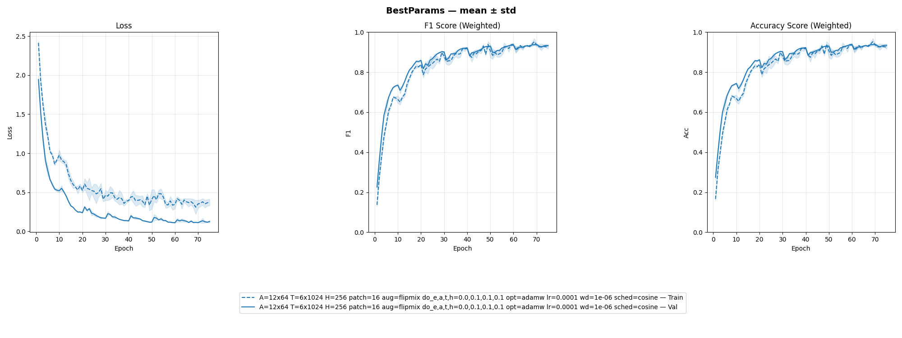
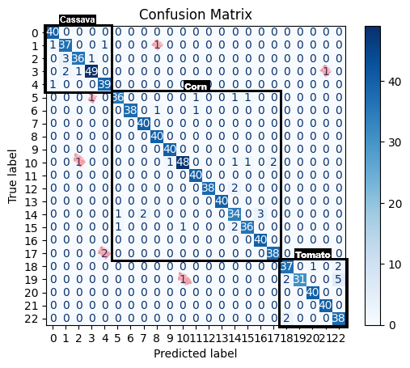
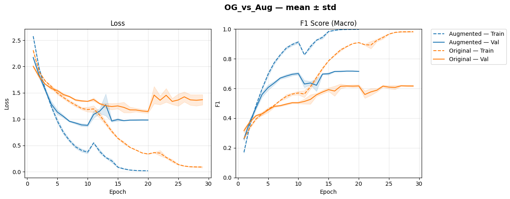

# AugViT: Vision Transformers for Plant Disease Diagnosis in the Field

A Vision Transformer (ViT) approach to plant disease classification, trained and evaluated on the **FieldPlant** dataset — real-world, smartphone-captured images from rural Cameroon. This project investigates how ViTs, paired with aggressive regularisation, can close the gap between lab-quality benchmarks and messy, in-field agricultural imagery.

## Highlights

- **F1 Score:** 0.9471
- **Accuracy:** 0.9457
- **FlipMix augmentation** alone contributed a **+0.1837** increase in F1 score
- Outperforms established CNN baselines on noisy, real-world field imagery
- Explores the precision vs. computational cost trade-off across ViT patch sizes

## Abstract

The deployment of computer vision for Plant Disease Diagnosis (PDD) faces a trade-off between laboratory-quality precision and image quality versus practical, in-field usability and amateur data collection. Furthermore, data scarcity and class imbalance inherent in agricultural datasets severely constrain model performance. This study investigates the application of Vision Transformers (ViTs) coupled with robust regularisation strategies to classify plant diseases using the FieldPlant dataset from rural Cameroon, which consists of messy, real-world smartphone imagery. The attention mechanism of ViTs, when stabilised by aggressive augmentation — the online "FlipMix" training strategy — outperforms established Convolutional Neural Network (CNN) baselines. The proposed methodology achieved an F1 score of 0.9471 and an Accuracy of 0.9457, with FlipMix alone driving a +0.1837 increase in the F1 score. While smaller patch sizes yielded higher precision, they imposed substantial computational costs. These memory and training time trade-offs, alongside hardware-induced epoch constraints, highlight the need for future model compression research to viably deploy ViT implementations for farmers in the developing world.

## Results

<!-- TODO: replace with your actual image paths, e.g. assets/confusion_matrix.png -->
| Training Curves | Confusion Matrix |
|---|---|
|  |  |

<!-- TODO: add any additional figures here — e.g. sample predictions, FlipMix ablation bar chart, patch size vs. precision/time trade-off plot -->


## Method Overview

- **Backbone:** Vision Transformer (ViT)
- **Key technique — FlipMix:** an online augmentation strategy that stabilises the ViT attention mechanism under noisy, amateur-quality field imagery, contributing the largest single gain in F1 score (+0.1837)
- **Dataset:** [FieldPlant](https://ieeexplore.ieee.org/document/10086516/) — real-world smartphone imagery of diseased crops, collected in rural Cameroon
- **Trade-offs explored:** patch size vs. precision vs. computational/memory cost; hardware-induced epoch constraints on training time

For full methodology, experiments, and discussion, see the [paper](paper/augvit-report.pdf).

## Repository Structure

```
.
├── notebooks/     # Notebook-driven training, evaluation, and ablation experiments
├── paper/         # Full written report / capstone paper
├── assets/        # (add this) Figures and plots referenced in this README
└── README.md
```

> This project is notebook-driven — there is no single training script entry point. See `notebooks/` for the full pipeline, in order.

- `notebooks/asmt2-preprocessor_aug_tensor.ipynb` — FieldPlant augmentation, cleaning, class balance analysis
- `notebooks/asmt2-ablation_trainer.ipynb` — FlipMix implementation and ablation
- `notebooks/asmt2-best_model.ipynb` — Final evaluation, confusion matrix, F1/accuracy reporting

## Dependencies

| Tool | Version |
|---|---|
| Python | 3.12.5 |
| pip | 26.0.1 |
| Jupyter Notebook | 2025.9.1 |
| PyTorch | 2.11.0+cu126 |

<!-- TODO: add other key libraries if relevant, e.g. timm, torchvision, scikit-learn, albumentations -->

## Dataset

This project uses the **FieldPlant** dataset:

> [FieldPlant: A Dataset of Field Plant Images for Plant Disease Detection and Classification with Deep Learning](https://ieeexplore.ieee.org/document/10086516/)

FieldPlant is not included in this repository — see the paper for access details.

## Future Work

- Model compression (e.g. distillation, pruning, quantisation) to make ViT-based PDD viable on low-resource, in-field hardware
- Further exploration of the patch size vs. precision vs. compute trade-off
- Extending FlipMix or similar augmentation strategies to other noisy, real-world agricultural datasets
